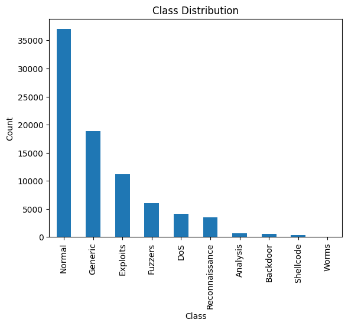
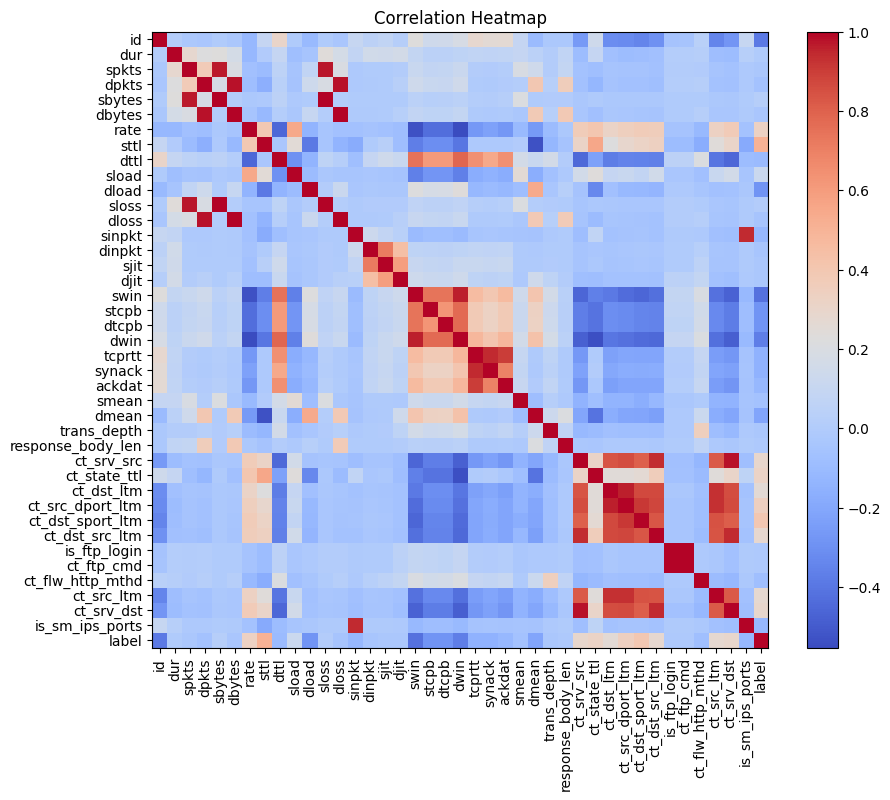
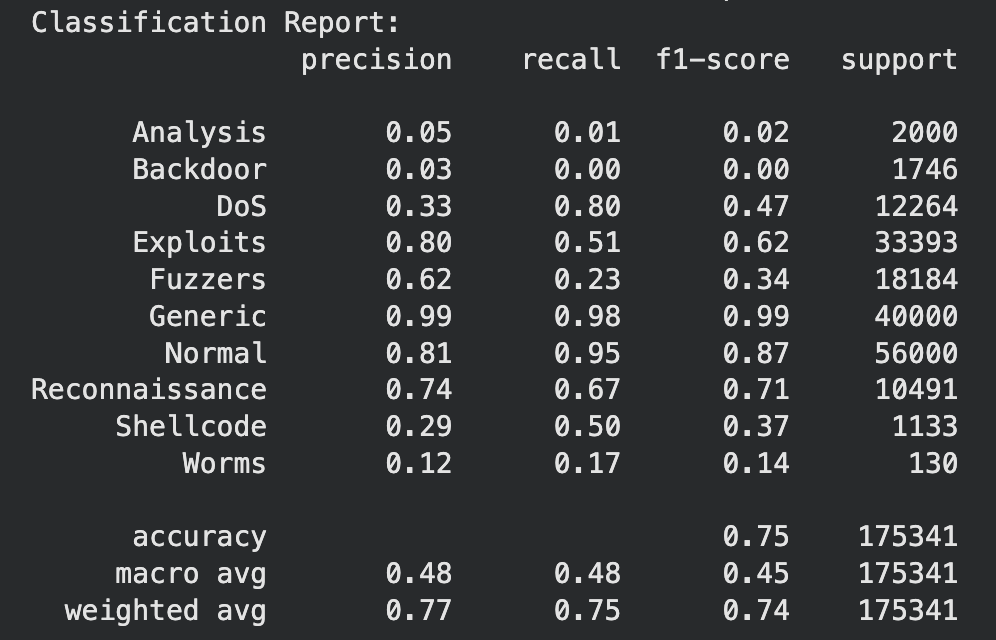
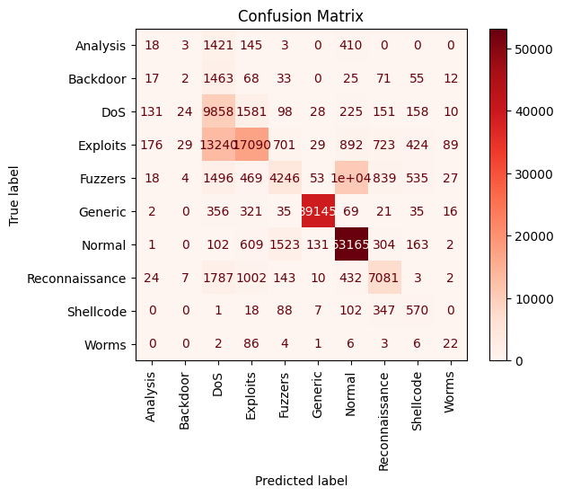
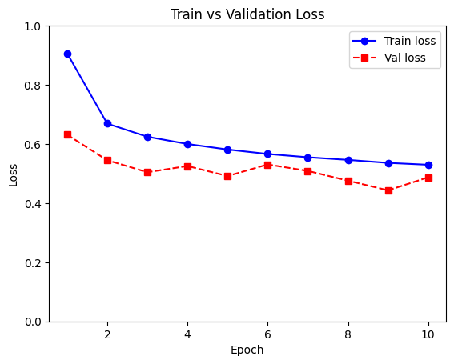
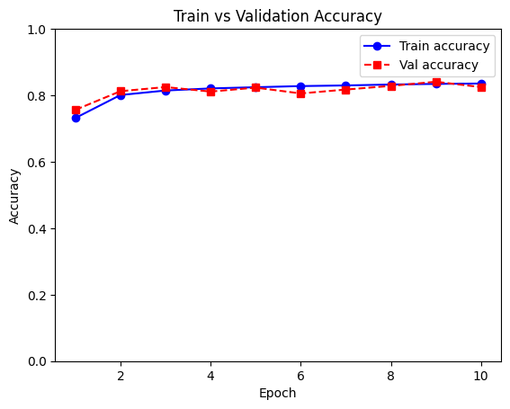
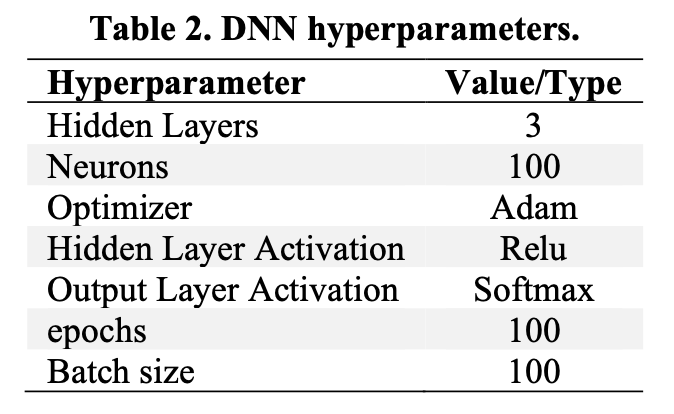
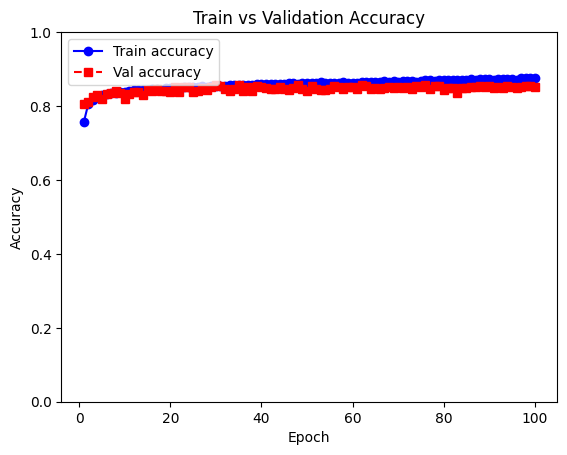
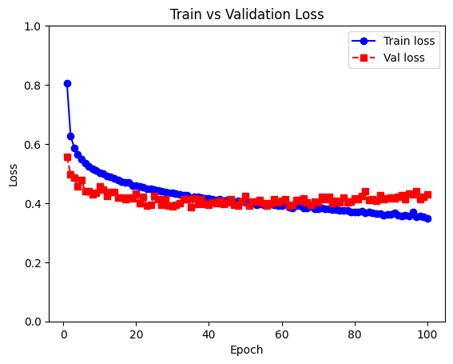
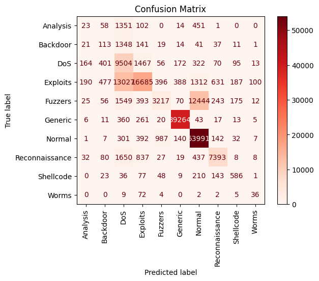

# Intrusion Detection System using Deep Learning techniques
## Abstract (TODO)

## Introduction

The increasing dependence on computer networks has made cybersecurity a critical area for organizations, institutions, and users. As network traffic continues to grow, malicious activities have become more frequent and difficult to detect using traditional security mechanisms alone. For this reason, Intrusion Detection Systems (IDS) are widely used to monitor network behavior and identify suspicious or abnormal traffic patterns.

Machine learning and deep learning techniques have become important tools for intrusion detection because they can analyze large volumes of network data and learn patterns that may indicate malicious behavior. Unlike traditional rule-based systems, which depend on predefined signatures, learning-based models can identify relationships among features and classify traffic based on previously observed examples. This makes them useful for detecting both normal and attack traffic in complex datasets.

This project focuses on the development of a deep learning model for multiclass intrusion detection using the UNSW-NB15 dataset. The dataset contains network traffic records labeled according to different attack categories.

The original training and testing datasets provided by Kaggle were preserved to maintain a consistent evaluation process. The preprocessing stage includes removing non-relevant or leakage columns, encoding categorical features, scaling numerical values, and transforming attack categories into numerical labels. Additionally, because the dataset is highly imbalanced, less aggressive class weights were applied during training to reduce the effect of dominant classes and improve the model’s ability to detect minority attack categories.

TODO: Add more details about the model architecture, training process, and evaluation metrics once aligned with the paper
The model is implemented using a [here goes the final model architecture]. Its performance is evaluated using accuracy, precision, recall, F1-score [change for paper metrics' later].

## Dataset

The dataset used in this project is the [UNSW-NB15](https://www.kaggle.com/datasets/mrwellsdavid/unsw-nb15) dataset, which is commonly used for the development and evaluation of Network Intrusion Detection Systems. It contains network traffic records generated from both normal network activity and different simulated attack behaviors. The main purpose of the dataset is to provide representative network traffic data for training models capable of distinguishing between legitimate and malicious connections.

The version used in this project was obtained from Kaggle and is already divided into two main files: a training set and a testing set. This original separation was preserved in order to maintain a consistent evaluation process. The training dataset was used to train the model and to create a validation subset, while the testing dataset was kept separate and used only for the final evaluation.

The dataset contains numerical, nominal, and binary attributes that describe different characteristics of network traffic, such as protocol type, service, connection state, duration, number of packets, number of bytes, transmission rates, time-to-live values, and other connection-based indicators.

The dataset includes two main label columns: `label` and `attack_cat`. The `label` column is used for binary classification, where `0` represents normal traffic and `1` represents attack traffic. However, this project focuses on multiclass classification using the `attack_cat` column as the target variable. This allows the model to classify each record into one of ten traffic categories: `Normal`, `Generic`, `Exploits`, `Fuzzers`, `DoS`, `Reconnaissance`, `Analysis`, `Backdoor`, `Shellcode`, and `Worms`.

An important characteristic of this dataset is its strong class imbalance. Some categories, such as `Normal`, `Generic`, and `Exploits`, contain a large number of records, while minority classes such as `Worms`, `Shellcode`, `Backdoor`, and `Analysis` contain significantly fewer samples. This imbalance makes the classification task more challenging because the model may favor majority classes during training.

The following table presents the main attributes used in the dataset and their general descriptions.

| Attribute           | Type      | Description                                                                                        |
| ------------------- | --------- | -------------------------------------------------------------------------------------------------- |
| `id`                | Numerical | Unique identifier of the record. It is not used as an input feature for the model.                 |
| `dur`               | Numerical | Duration of the network connection or flow.                                                        |
| `proto`             | Nominal   | Protocol used in the connection, such as TCP, UDP, or others.                                      |
| `service`           | Nominal   | Network service associated with the flow, such as HTTP, DNS, FTP, or others.                       |
| `state`             | Nominal   | State of the network connection.                                                                   |
| `spkts`             | Numerical | Number of packets sent from the source to the destination.                                         |
| `dpkts`             | Numerical | Number of packets sent from the destination to the source.                                         |
| `sbytes`            | Numerical | Number of bytes sent from the source to the destination.                                           |
| `dbytes`            | Numerical | Number of bytes sent from the destination to the source.                                           |
| `rate`              | Numerical | Transmission rate of the network flow.                                                             |
| `sttl`              | Numerical | Source time-to-live value.                                                                         |
| `dttl`              | Numerical | Destination time-to-live value.                                                                    |
| `sload`             | Numerical | Source bits per second.                                                                            |
| `dload`             | Numerical | Destination bits per second.                                                                       |
| `sloss`             | Numerical | Number of packets lost from the source side.                                                       |
| `dloss`             | Numerical | Number of packets lost from the destination side.                                                  |
| `sinpkt`            | Numerical | Inter-packet arrival time from the source side.                                                    |
| `dinpkt`            | Numerical | Inter-packet arrival time from the destination side.                                               |
| `sjit`              | Numerical | Source jitter value.                                                                               |
| `djit`              | Numerical | Destination jitter value.                                                                          |
| `swin`              | Numerical | TCP window size from the source side.                                                              |
| `dwin`              | Numerical | TCP window size from the destination side.                                                         |
| `stcpb`             | Numerical | TCP base sequence number from the source side.                                                     |
| `dtcpb`             | Numerical | TCP base sequence number from the destination side.                                                |
| `tcprtt`            | Numerical | TCP round-trip time.                                                                               |
| `synack`            | Numerical | Time between SYN and SYN-ACK packets.                                                              |
| `ackdat`            | Numerical | Time between ACK and data packets.                                                                 |
| `smean`             | Numerical | Mean packet size from the source side.                                                             |
| `dmean`             | Numerical | Mean packet size from the destination side.                                                        |
| `trans_depth`       | Numerical | Transaction depth, commonly related to application-level traffic such as HTTP.                     |
| `response_body_len` | Numerical | Length of the response body.                                                                       |
| `ct_srv_src`        | Numerical | Number of connections with the same service and source address.                                    |
| `ct_state_ttl`      | Numerical | Number of connections with the same state and TTL value.                                           |
| `ct_dst_ltm`        | Numerical | Number of connections to the same destination in a short time window.                              |
| `ct_src_dport_ltm`  | Numerical | Number of connections from the same source to the same destination port in a short time window.    |
| `ct_dst_sport_ltm`  | Numerical | Number of connections to the same destination from the same source port in a short time window.    |
| `ct_dst_src_ltm`    | Numerical | Number of connections between the same source and destination in a short time window.              |
| `is_ftp_login`      | Binary    | Indicates whether the connection corresponds to an FTP login.                                      |
| `ct_ftp_cmd`        | Numerical | Number of FTP commands detected.                                                                   |
| `ct_flw_http_mthd`  | Numerical | Number of HTTP methods observed in the flow.                                                       |
| `ct_src_ltm`        | Numerical | Number of connections from the same source in a short time window.                                 |
| `ct_srv_dst`        | Numerical | Number of connections with the same service toward the destination.                                |
| `is_sm_ips_ports`   | Binary    | Indicates whether the source and destination IP addresses and ports are the same.                  |
| `attack_cat`        | Nominal   | Traffic category or attack family. This is the target variable used for multiclass classification. |
| `label`             | Binary    | Binary label of the traffic: `0` for normal traffic and `1` for attack traffic.                    |

## Methodology

### Preprocessing

The training dataset contains **82,332 records** and includes network traffic observations classified into ten categories using the `attack_cat` variable. These categories represent both normal traffic and different types of cyberattacks: `Normal`, `Generic`, `Exploits`, `Fuzzers`, `DoS`, `Reconnaissance`, `Analysis`, `Backdoor`, `Shellcode`, and `Worms`.

The dataset is composed of numerical, categorical, and binary variables. The numerical variables describe measurable characteristics of the network flow, such as duration, packet counts, byte counts, transmission rate, time-to-live values, load, loss, jitter, and connection counters. The categorical variables include attributes such as protocol type, service, and connection state. The target variable used in this project is `attack_cat`, which represents the specific traffic category or attack family.

The class distribution in the training dataset shows a strong imbalance among the categories. The `Normal` class contains 37,000 records, making it the most represented class, followed by `Generic` with 18,871 records and `Exploits` with 11,132 records. In contrast, minority classes such as `Analysis`, `Backdoor`, `Shellcode`, and `Worms` contain significantly fewer records, with `Worms` having only 44 samples.

| Class          | Number of Records |
| -------------- | ----------------: |
| Normal         |            37,000 |
| Generic        |            18,871 |
| Exploits       |            11,132 |
| Fuzzers        |             6,062 |
| DoS            |             4,089 |
| Reconnaissance |             3,496 |
| Analysis       |               677 |
| Backdoor       |               583 |
| Shellcode      |               378 |
| Worms          |                44 |

  
   
  <em> Graph 1. Class distribution of the attack_cat categories in the training dataset</em>

This imbalance is important because a model trained directly on the original distribution may favor majority classes such as `Normal`, `Generic`, and `Exploits`, while performing poorly on minority attack categories. Therefore, the class distribution was analyzed before training. Instead of artificially oversampling or generating synthetic records, less aggressive class weights were applied during model training. This approach allowed the model to assign higher importance to minority classes without modifying the original dataset or generating potentially unrealistic network traffic samples.

#### Encoding of Categorical Variables

Since neural networks cannot directly process categorical text values, categorical variables were transformed into numerical representations. The input categorical attributes, such as `proto`, `service`, and `state`, were encoded using **One-Hot Encoding**. This technique converts each category into a separate binary column, preventing the model from assuming an artificial ordinal relationship between nominal categories.

The target variable `attack_cat` was encoded using **Label Encoding**, assigning a numerical value to each traffic class. This encoding was appropriate for the target variable because the model uses a softmax output layer with `sparse_categorical_crossentropy`, which expects class labels as integer values.

The columns `id`, `label`, and `attack_cat` were removed from the input features before training. The `id` column was removed because it is only an identifier and does not provide meaningful information for classification. The `label` column was removed because it corresponds to binary classification, while this project focuses on multiclass classification. The `attack_cat` column was removed from the input features to avoid data leakage, since it is the target variable that the model is trying to predict.

#### Feature Scaling

After encoding categorical variables, the numerical features were scaled using standardization. Scaling was applied because neural networks are sensitive to the magnitude of input values, and the dataset contains features with different ranges, such as packet counts, byte counts, rates, and time-based measurements. Standardizing the features helps the model train more consistently and prevents variables with larger numerical ranges from dominating the learning process.

The scaler was fitted only on the training data and then applied to the testing data. This was done to avoid data leakage and ensure that the test set remained unseen during the preprocessing learning process.

#### Multicollinearity Analysis

A correlation matrix and heatmap were generated using the numerical variables in the dataset. The heatmap shows that some groups of variables present strong correlations, especially features related to packet counts, byte counts, TCP behavior, and connection counters. For example, variables such as `spkts`, `dpkts`, `sbytes`, `dbytes`, `sloss`, and `dloss` show visible correlation patterns. Similarly, some connection-based attributes such as `ct_srv_src`, `ct_dst_ltm`, `ct_src_dport_ltm`, `ct_dst_sport_ltm`, and `ct_srv_dst` also show notable relationships.

However, because the model used in this project is a neural network, no feature removal was performed at this stage based only on correlation. Neural networks can learn from correlated features, and the objective of this initial implementation was to preserve the original features after basic preprocessing. Therefore, all relevant features were kept.

  
   
  <em>Graph 2. Correlation heatmap of the numerical variables in the training dataset</em>

### Model Architecture

The model implemented in this stage of the project is a simple feed-forward neural network designed for multiclass intrusion detection. The objective of the model is to classify each network traffic record into one of the ten categories defined by the attack category column.

The architecture consists of three hidden dense layers followed by a softmax output layer. The first hidden layer contains 64 neurons with ReLU activation, the second hidden layer contains 32 neurons with ReLU activation, and the third hidden layer contains 16 neurons with ReLU activation. The output layer contains 10 neurons, one for each class, and uses the softmax activation function to generate a probability distribution across the possible traffic categories.

The model was compiled using the Adam optimizer and the `sparse_categorical_crossentropy` loss function. This loss function was selected because the target labels were encoded as integer values using label encoding. The main metric used during training was accuracy.

The implemented architecture is summarized as follows:

| Layer         |                         Neurons | Activation Function | Purpose                                                    |
| ------------- | ------------------------------: | ------------------- | ---------------------------------------------------------- |
| Input Layer   | Number of preprocessed features | N/A                 | Receives the encoded and scaled dataset features           |
| Dense Layer 1 |                              64 | ReLU                | Learns initial nonlinear patterns from the input data      |
| Dense Layer 2 |                              32 | ReLU                | Learns intermediate feature representations                |
| Dense Layer 3 |                              16 | ReLU                | Learns a more compact representation before classification |
| Output Layer  |                              10 | Softmax             | Produces class probabilities for multiclass classification |

The model contains a total of **15,002 trainable parameters**. This architecture was used as an initial baseline before implementing a deeper architecture based on the reference paper.

#### Paper-Based DNN Architecture

After implementing the initial baseline model, a second experiment was developed using the DNN configuration described in the reference paper. This architecture was selected because the paper reports it as one of its main deep learning models for multiclass intrusion detection using the UNSW-NB15 dataset.

The paper-based DNN configuration uses three hidden layers with 100 neurons, the Adam optimizer, ReLU activation in the hidden layers, Softmax activation in the output layer, 100 epochs, and a batch size of 100. Since this project performs multiclass classification using the `attack_cat` column, the output layer was configured with 10 neurons, one for each traffic category.

The implemented paper-based DNN architecture is summarized as follows:

| Hyperparameter           |                           Value |
| ------------------------ | ------------------------------: |
| Hidden Layers            |                               3 |
| Neurons per Hidden Layer |                             100 |
| Optimizer                |                            Adam |
| Hidden Layer Activation  |                            ReLU |
| Output Layer Activation  |                         Softmax |
| Epochs                   |                             100 |
| Batch Size               |                             100 |
| Output Classes           |                              10 |
| Loss Function            | Sparse Categorical Crossentropy |

This model was compiled using the Adam optimizer and the `sparse_categorical_crossentropy` loss function. The target labels were kept as integer-encoded values, which is why sparse categorical crossentropy was appropriate. Accuracy was used as the main training metric, following the evaluation approach used in the reference paper.

## Experiments and Results

### Experiment 1: Baseline Model

The model was trained for **10 epochs** using the original Kaggle training set, with a validation subset created from the training data. The original Kaggle testing set was kept separate and used only for final evaluation. Less aggressive class weights were applied during training to address the strong class imbalance without artificially modifying the dataset.

The reference paper evaluates its deep learning models mainly using **accuracy** and **loss**. Following that approach, the implemented model was evaluated using training accuracy, validation accuracy, testing accuracy, and testing loss.

During training, the model showed a gradual improvement in both training and validation accuracy. The training accuracy increased from approximately **73.19%** in the first epoch to **83.55%** in the final epoch. Validation accuracy also improved from **78.16%** in the first epoch to approximately **82.52%** in the final epoch.

The final evaluation on the testing dataset produced the following results:

| Metric                    |  Value |
| ------------------------- | -----: |
| Test Accuracy             | 74.20% |
| Test Loss                 | 0.7263 |
| Final Training Accuracy   | 83.55% |
| Final Training Loss       | 0.5332 |
| Final Validation Accuracy | 82.52% |
| Final Validation Loss     | 0.4853 |

In addition to accuracy and loss, a classification report and confusion matrix were generated to better understand the model’s behavior across classes. The weighted F1-score was approximately **0.73**, while the macro F1-score was approximately **0.46**. This confirms that the model performs well on majority classes such as `Generic` and `Normal`, but still struggles with minority classes such as `Analysis`, `Backdoor`, `Shellcode`, and `Worms`.

  
   
  <em>Table N. Classification report for the obtained results</em>

  
   
  <em>Graph N. Confusion matrix for the obtained results</em>

The training and validation curves were analyzed to evaluate the behavior of the implemented baseline model during the learning process. The loss graph shows that the training loss decreases consistently across the 10 epochs. The validation loss also remains relatively stable and decreases overall. Since the validation loss does not increase significantly while the training loss decreases, there is no overfitting.

The accuracy graph also shows stable learning behavior. Training accuracy increases from approximately 0.73 to 0.84, while validation accuracy remains close to the training curve, reaching values around 0.82–0.83. The closeness between both curves suggests that the model is not memorizing the training data excessively. Additionally, the model does not show clear signs of underfitting, since both training and validation accuracy reach acceptable values for an initial multiclass classification baseline.

  
   
  <em>Graph N. Training and validation loss curves</em>

  
   
  <em>Graph N. Training and validation accuracy curves</em>

Based on the results, the implemented model provides a functional baseline for multiclass intrusion detection. However, the performance across minority classes indicates that further experimentation is needed. Future improvements will include testing a deeper architecture inspired by the reference paper, adjusting hyperparameters, increasing the number of epochs with early stopping, and comparing different class weighting strategies.

### Experiment 2: Paper-Based DNN Architecture

A second experiment was performed using the DNN hyperparameter configuration proposed in the reference paper. Unlike the baseline model, which used a smaller architecture with 64, 32, and 16 neurons, this experiment used three hidden layers with 100 neurons each. The model was trained for 100 epochs with a batch size of 100, using the Adam optimizer, ReLU activation in the hidden layers, and Softmax activation in the output layer.

  
   
  <em>Table N. DNN hyperparameters based on the reference paper</em>

The training and validation accuracy curves show stable learning behavior across the 100 epochs. Training accuracy increased steadily and remained slightly above validation accuracy during the later epochs. Validation accuracy stayed close to the training curve. This indicates that the model was able to learn useful patterns without showing overfitting.

  
   
  <em>Graph N. Training and validation accuracy curves for the paper-based DNN model</em>

The loss curves show that training loss decreased consistently throughout the 100 epochs. Validation loss decreased during the early epochs and later stabilized with small fluctuations. Toward the final epochs, training loss continued decreasing while validation loss remained slightly higher, which suggests a bit of overfitting. However, the validation loss did not increase sharply, so the model did not show an overfitting problem.

  
   
  <em>Graph N. Training and validation loss curves for the paper-based DNN model</em>

The final evaluation on the testing dataset produced the following results:

| Metric                 |  Value |
| ---------------------- | -----: |
| Test Accuracy          | 74.60% |
| Test Loss              | 1.1996 |
| Macro Avg Precision    |   0.53 |
| Macro Avg Recall       |   0.50 |
| Macro Avg F1-Score     |   0.48 |
| Weighted Avg Precision |   0.78 |
| Weighted Avg Recall    |   0.75 |
| Weighted Avg F1-Score  |   0.73 |

The paper-based DNN model achieved a test accuracy of **74.60%**, which is slightly higher than the baseline model. Although the improvement in accuracy was small, the macro average F1-score increased to **0.48**, compared to approximately **0.46** in the baseline model. This is relevant because macro F1-score gives equal importance to all classes, including minority attack categories.

The classification report shows that the model performed strongly on majority classes such as `Generic` and `Normal`, with F1-scores of **0.98** and **0.86**, respectively. It also showed good performance on `Reconnaissance`, with an F1-score of **0.77**, and improved detection of `Shellcode`, which reached an F1-score of **0.52**. However, the model still struggled with minority classes such as `Analysis` and `Backdoor`, which obtained F1-scores of **0.02** and **0.08**, respectively.

The confusion matrix confirms that most `Generic` and `Normal` samples were correctly classified. However, minority classes were often confused with more represented categories such as `DoS`, `Exploits`, and `Normal`. This indicates that class imbalance remains a major challenge, even when using class weights and a larger architecture.

  
   
  <em>Graph N. Confusion matrix for the paper-based DNN model</em>

Overall, the paper-based DNN model provides a stronger experimental foundation than the baseline model because it follows the hyperparameter configuration proposed in the reference paper. However, the results show that the architecture still requires further experimentation to improve the detection of minority attack categories.

### Experiment 3: Paper-Based ANN Architecture TODO

### Experiment Comparison TODO

### Hyperparameter Tuning TODO

## Conclusion

## References
Aleesa, Ahmed & Thanoun, Mohammed & Mohammed, Ahmed & Sahar, Nan. (2021). DEEP-INTRUSION DETECTION SYSTEM WITH ENHANCED UNSW-NB15 DATASET BASED ON DEEP LEARNING TECHNIQUES. Journal of Engineering Science and Technology. 16. 711-727.

"Deep learning in intrusion detection systems," IEEE Conference Publication | IEEE Xplore, Dec. 01, 2018. https://ieeexplore.ieee.org/document/8625278
